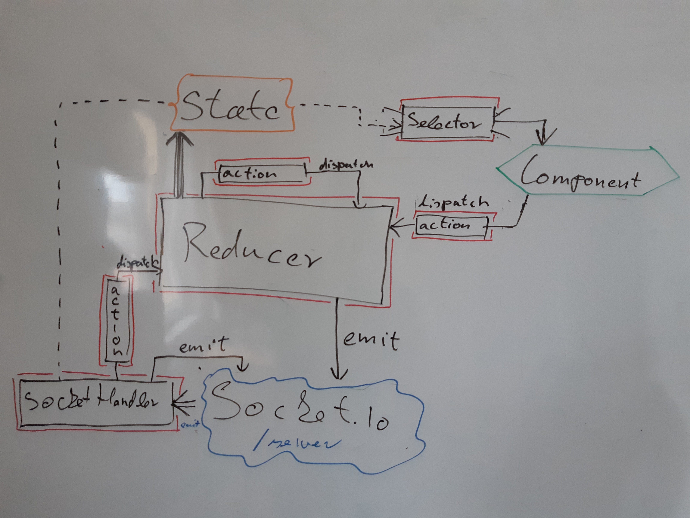

# State management

Alapvetően a state management a reducer patternre épül (useReducer hook) kiegészítve SocketIo és dispatch esemény kiváltásával.
A játéktérhez tartozó state management modulok a Game/store mappában találhatóak.



## /actions

Az action feladata, hogy biztosítsa a dispatch függvénynek átadott objektum helyességét.
(Intellisense a paraméterezésre, type tag automatikus töltése)
Összességében egy függvényről beszélünk ami a bemeneti paraméterei alapján egy objektummal tér visza.
Az action típusát egy string határozza meg, amit a reducerben is meg kell adni, ezért a függvényt utólag bővíttem ezzel az egyedi azonosítóval.

Az actionoket tartalmazó fileokat nagyobb egységekbe csoportosítottam (container, player, stb...)

### Elnevezési konvenciók
Mivel egy esemény hatására akár több action kiváltására és kezelésére van szükség, ezért elnevezésben is próbálok utalni az esemény futtatási idejére / szintjére. Ha a felhasználó által kiváltott dologról van szó, akkor az felszólító módú azonosítót kap (pl: `moveCardAction`), ha a szerver által közölt tényről van szó, akkor pedig múlt idejű az elnevezés (pl: removedCardAction). Mint ahogy az előző 2 elnevezés is mutatja, az azonosító itt tartalmazza azt hogy egy action-ről van szó és azt is, hogy milyen objektummal dolgozik (pl. Card).

### Példa

```javascript
const insertedCardAction = (card, container) => ({
  type: insertedCardAction.type,
  payload: card,
  holder: container,
});
insertedCardAction.type = 'CONTAINER_INSERT_CARD';
export { insertedCardAction };
```

## /reducers
### Elméleti háttér
A reducerek feladata az eredeti state módosításhoz képest kibővül a SocketIo események kiváltásával is.
Az eredet switch-case-t használó minta átalakult, hogy külön fileokba tudjanak szerveződni az action-okhoz kapcsolódó kezelő függvények. Az index.js file tartalmazza a kezelők összegyűjtését és az események kiváltásának irányítását ezek között. A többi file a mappában egy-egy objektummal tér vissza ahol az azonosító határozza meg, hogy melyik eseményt hivatott kezelni, és az érték maga a kezelő függvény.

### Struktúrálás
A reducerekhez függvények a /reducers mappában vannak összegyűjtve. Az index.js képez egyedül kivételt, mert ez nem kezelő függvényeket tartalmaz, hanem ez felel a kezelő függvények összegyűjtéséért, és az esemény lekezelése során kiváltott újabb dispatch események megfelelő sorrendű lefuttatásáért. Itt kell hozzá adni új kezelő objektumokat a rendszerhez.

``` javascript
import gameReducer from './gameReducer';

const subReducersObjects = [
  gameReducer,
  //...
]
```
A többi file egy objektumot exportál, melynek tagjai határozzák meg, hogy milyen típusú actionre hallgat.
Ezt érdemes az action type tagja alapján használni, mivel így fordítási időben kiderül az action nevének elgépelése is.

A Kezelő függvények 1 db object paraméterrel kerülnek meghívásra, ami a következő tagokat tartalmazza:
- state: az aktuális state
- action: a kiváltott action adatai
- dispatch: függvény amivel további action-ok kiváltását kérhetjük a rendszertől.
- emit: függvény amivel SocketIo-n keresztül küldhetünk jelzést a szervernek.

Ha van kezelő függvény nem létezik, vagy nincs semmilyen visszatérési értéke, akkor a state nem módosul.

Előfordulhat, hogy egy esemény kezelés során további dispatch hívásokra is szükség van.
Ilyenkor ezeket összegyűjti, megvárja a függvény befejezését és az így módosult staten kezdi hívni a menet közben elkapott hívásokat. Ha több esemény is kiváltásra kerül, akkor sorrendben a legelsőt hajtja végre, majd az általa kiváltott további eseményeket mélységi bejárás szerint, és ezt követi a további elkapott események végrehajtása, mindig az előzőekben frissített state-tel.

Lehetőség van dispatch meghívására utólag is (pl Promise sikeressége eseetén), viszont ilyenkor teljesen új dispatch hívás kezdődik, ezért okozhat gondot, ha többször kerül meghívásra. Ha ilyenre van szükség akkor vagy biztosítod, hogy a promise csak 1 dispatch hívást indítson és a továbbiak azon belül futnak le, vagy ha sokszor előjön, akkor kiteszteljük és megírjuk, hogy jól kezelje a dolgot.

Emit függvény hívása során semmilyen különösebb gond nincs, első paramétere a signal azonosítója, és ezt követik a paraméterei.

```javascript
function removedCardHandler({ state, action, dispatch, emit }) {
  const old = action.payload;
  const cards = state.containers[action.holder].cards;
  return {
    ...state,
    containers: {
      ...state.containers,
      [action.holder]: {
        ...state.containers[action.holder],
        cards: cards.filter(
          (c) =>
            (c.id == null || c.id !== old.id) &&
            (c._id == null || c._id !== old._id)
        ),
      },
    },
  };
}

export default {
  [removedCardAction.type]: removedCardHandler,
};
```

## /socketHandlers  

Ezek a fileok a reducerek mintájára kerültek kialakításra, az index.js összegyűjti az objektumokból a kezelő függvényeket az azonosítók alapján. A fő különbség, hogy ezek a függvények a Socket.io kapcsolaton érkező jelzések elkapására szolgálnak. 1 paraméterrel kerül hívásra aminek tagjai:
- dispatch: Action kiváltása a reducer felé. szintén nem kezelt a több esemény sorozatos kiváltása ilyen esetben létre kell hozni egy a socket eseménynek megfelelő kezelőt a reducer-ben azt meghívni minden szükséges adattal, ott már kezelve lesz a több dispatch hívás.
- emit: SoketIo jelzés küldése
- event: a kezelt esemény azonosítója
- params: egy lista a szervertől kapott jelzés paraméterekkel. Az esetek nagy részében 1 elemet tartalmaz.
- state: a játék aktuális állapota

```javascript
import { insertedCardAction } from '../actions/container';

function CARD_ADDED({ dispatch, params: [action] }) {
  const { container, card } = action;
  if (card.id == null) card._id = localId();
  dispatch(insertedCardAction(card, container));
}

export { CARD_ADDED };
```

## /selectors
A selectorok feladata, hogy a state alapján előállítsanak a komponensekben is könnyen használható adatszerkezeteket.
Valójában egy függvényről beszélünk, ami megkapja paraméterként a state-t és egyéb információkat ami alapján le tudja válogatni a keresett értékeket.

Készült hozzá egy useSelector nevű hook, ami biztosítja a megfelelő state-k automatikus átadását, illetve megadható egy dependency lista a selectornak, amivel kiszűrhető, hogy mikor van szükség az értékek újra számolására.

A következő példában a selector az adott játékoshoz tartozó összes kártya tárolót válogatja le.

A kiegészítő adatok a useSelector hook működését szabályozzák, StateContext nevű context alapján kerül betöltésre az első paraméter (akár lehetne több contextet is használni) és deps függvény pedig azt határozza meg, hogy akkor kell újraszámolni egy játékos kártya tartóit, ha megváltozik a játékos azonosítója, vagy megváltozik a kártya tárolók listája.

Az alatta látható két hívás pontosan ugyan azt az eredményt produkálja, viszont nem vizsgálja a függőségeket, ezért minden render művelet során teljesen újra elő állítja az adatokat.

```javascript

function playerContainerListSelector(state, playerId) {
  return Object.values(state.containers).filter(
    (c) => c.player === playerId && playerId !== null
  );
}
playerContainerListSelector.contexts = [StateContext];
playerContainerListSelector.deps = (state, playerId) => [
  state.containers,
  playerId,
];

// useSelectorral használva
const containers = useSelector(
    playerContainerListSelector,
    player && player.id
);

// useSelector nélkül használva
const state = useContext(StateContext);
const containers = playerContainerListSelector(
  state, 
  player && player.id
);

```


